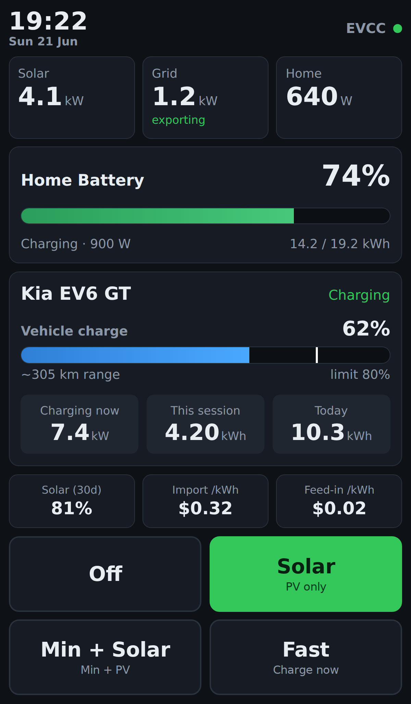

# evcc-kiosk
Configuration for a Raspberry Pi Zero 2 W with a Waveshare ZERO-DISP-7a display running EVCC server and a custom lightweight UI in kiosk mode



## Pre-requisites

### Hardware

* [Rasbperry Pi Zero 2 W](https://www.raspberrypi.com/products/raspberry-pi-zero-2-w/)
* [Waveshare 7" Display Zero-DISP-7A](https://www.waveshare.com/wiki/Zero-DISP-7A)
* Micro SD Card
* USB-C power supply
  * 5V 3A+ so it powers both the display and Pi reliably
* Ethernet cable (this guide does not include WiFi configuration)

### Software

Download and install [Raspberry Pi Imager](https://www.raspberrypi.com/software/).
When you run it follow the options below to load the EVCC specific version to your SD card.

1. Device: Raspberry Pi Zero 2 W `Next`
2. OS: Other specific-purpose OS > Home automation > evcc > evcc `Next`
3. Storage: Choose your SD card `Next`

## Configuration

1. Insert the SD card with the EVCC software into the Pi
2. Install the Pi on the back of the display
3. Plug in ethernet and USB-C power
4. Wait for the device to boot
5. SSH into the device
   1. Run this command on your local machine (bash & PowerShell): `ssh admin@evcc`
   2. When prompted for the password enter `admin`
   3. When prompted, change the password
6. Reconnect to the device via SSH with the new password
7. Apply the tweaks script to the device by running this command:
   - `sudo apt install -y curl && curl -sSL https://raw.githubusercontent.com/AdamBearWA/evcc-kiosk/main/tweaks.sh | sudo bash`
8. Wait for the device to reboot
9. Reconnect to the device via SSH with the new password
10. Configure the device by running this command":
    - `curl -sSL https://raw.githubusercontent.com/AdamBearWA/evcc-kiosk/main/configure.sh | sudo bash`

`configure.sh` installs a custom kiosk UI (`kiosk/index.html`) to `/var/lib/kiosk/` and points the browser at it. The page is dark-themed out of the box, so no one-off theme setup is needed.

## Maintenance

The device maintains itself nightly at 04:00 via the `kiosk-update.timer` systemd timer, which runs a single ordered job:

1. Refreshes the apt package lists.
2. Applies unattended upgrades, scoped to **Debian security updates** and **evcc** only. `needrestart` restarts any services affected by a library update so the patches take effect without a reboot.
3. Recycles the browser exactly once: it **reboots** if a kernel update requires it (which also clears the gradual WPEWebKit memory growth), otherwise it just **restarts the browser** (which clears that growth on its own).

The kernel, Armbian board-support packages, and general OS packages are deliberately **excluded** from the automatic upgrades to keep the pinned, hand-built Cog browser stable. Apply those manually when needed:

```
sudo apt update && sudo apt full-upgrade
sudo reboot
```

## Performance

The Pi Zero 2 W is a modest device (quad-core Cortex-A53 at 1 GHz, 512 MB RAM), and EVCC's stock single-page app — Vue with an animated SVG energy-flow diagram and charts — is **CPU-bound** on this weak core: rendered locally, each touch takes 2–3 s to repaint, while the same instance is instant from a remote browser running on faster hardware. The CPU is the ultimate limit on how fast that app can repaint here.

The local display therefore runs a **custom lightweight UI** instead (see below); it is the single biggest factor in the kiosk's responsiveness. Alongside it, `tweaks.sh` and `configure.sh` apply a few targeted measures:

* **OOM safety ceiling** — `MemoryMax` on `kiosk.service` caps the browser cgroup, so a slow WPEWebKit memory leak is restarted rather than triggering a system-wide OOM that could take down `evcc`.
* **Unused services disabled** — `avahi`, `bluetooth` and `rpcbind` are turned off to trim the footprint and attack surface.
* **SD-card wear reduction** — volatile journald storage and a tmpfs `/tmp`.

### The custom kiosk UI

The local display loads a purpose-built page, `kiosk/index.html`, installed to `/var/lib/kiosk/index.html` and opened directly by Cog over `file://`:

* **Plain DOM, inline CSS, vanilla JS** — no framework, no animated SVG, no charts. Each update rewrites a few text nodes, so a touch is a trivial repaint rather than a full re-render.
* **Talks directly to EVCC** on `http://localhost:7070` — it reads `/api/state`, streams live updates over the `/ws` websocket, and posts charge-mode changes to `/api/loadpoints/{id}/mode/{mode}`. EVCC sends `Access-Control-Allow-Origin: *` and does not origin-check `/ws`, so the `file://` page needs **no reverse proxy**.
* **No external/CDN assets** — fully self-contained for an offline kiosk.

The screenshot above is produced by [`tools/screenshot/`](tools/screenshot/), which renders the page in a headless browser with sample data; run `npm run shot` there to regenerate it after UI changes.

The browser's resident set sits at around **62 MiB**, well within the `MemoryMax` ceiling, and zram swap use stays low — light enough that the CPU governor can stay on the stock `ondemand` setting while touch remains responsive.
